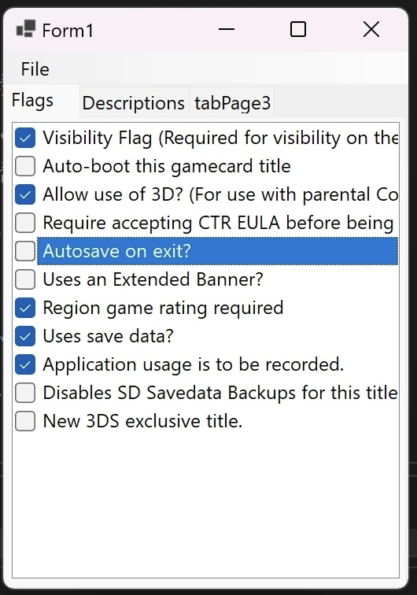
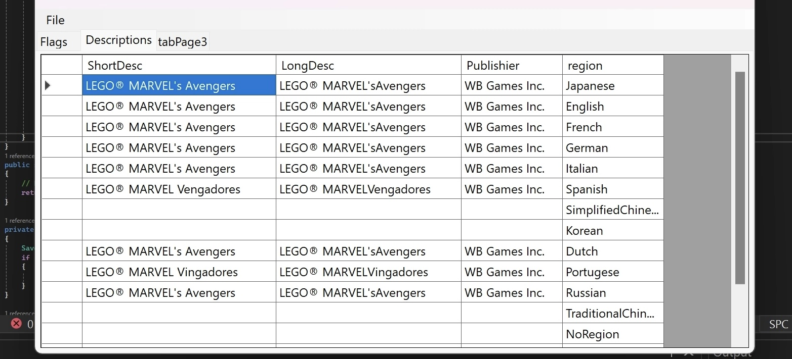

# SMDHEditor
It’s an editor for SMDH-icon on 3DS
(IMG_3497.jpeg)
# Flags
It’s an editor for SMDH-icon on 3DS. Here you can edit flags for games, (e.g. start N3DS-games on your O3DS, allow 3D and other)

# Descriptions
You can edit Descriptions and publishier on the any languages 

